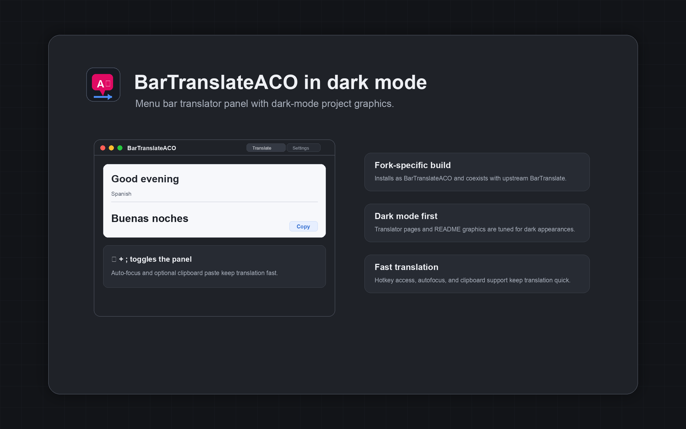
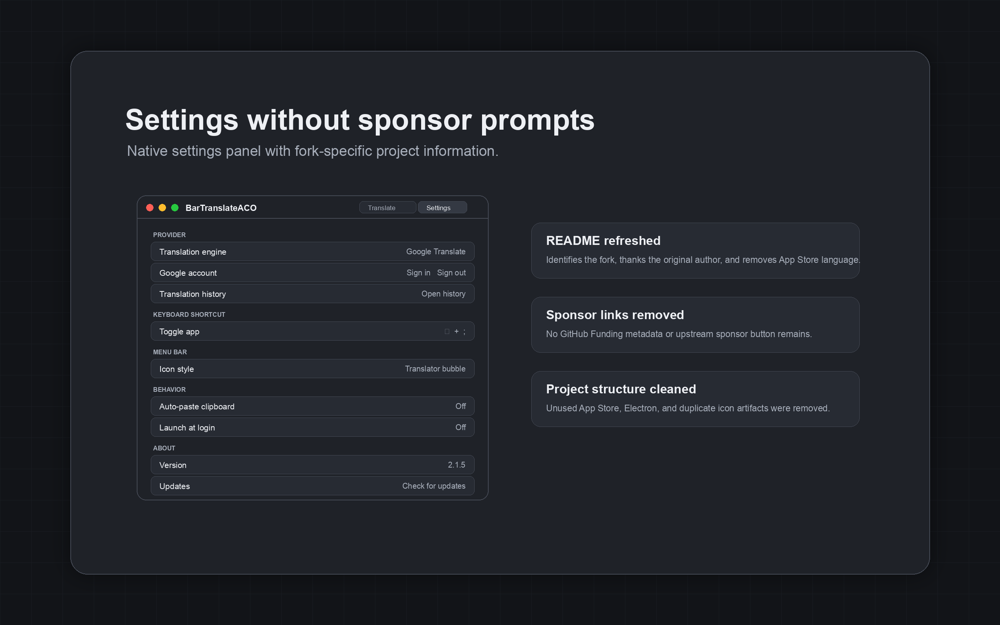

# BarTranslateACO

A dark-mode-friendly fork of [BarTranslate](https://github.com/ThijmenDam/BarTranslate), the handy menu bar translator widget for macOS.

<p align="center">
    
    <br/>
    
</p>

Translations are handled by presenting a streamlined webview of **Google Translate** in a quick, easily accessible menu bar interface.

## About this fork

BarTranslateACO is Andrew C. Oliver's fork of BarTranslate. It exists because this version needed dark-mode improvements, a fork-specific release path, and a place where changes can move independently when upstream pull-request review is slow.

Many thanks to [Thijmen Dam](https://github.com/ThijmenDam), the original BarTranslate author, for creating the app and releasing it as free software.

This fork also uses a different logo and menu bar artwork. The updated design is intended to work better in dark mode and to read more clearly as a translator app instead of a generic app icon.

Bugs, pull requests, and feature ideas are welcome in [acoliver/BarTranslate](https://github.com/acoliver/BarTranslate/issues).

## Features

* Menu bar access to Google Translate.
* Dark-mode styling for translation pages and project graphics.
* Configurable hotkeys to toggle the app.
* Smart autofocus on the source text field when opening the app.
* Optional automatic clipboard paste.
* Fork-specific Homebrew and manual releases that install as `BarTranslateACO.app`.

## Installation (Homebrew)

This fork is distributed with a fork-specific Homebrew formula so it can coexist with upstream BarTranslate:

```sh
brew tap acoliver/tap
brew install bartranslate-aco
```

The formula installs `BarTranslateACO.app` under Homebrew's prefix and provides a `bartranslate-aco` launcher script.

## Installation (manual)

1. Refer to the [latest releases](https://github.com/acoliver/BarTranslate/releases).
2. Download `bartranslate-aco-vX.Y.Z-universal-apple-darwin.zip`.
3. Unzip the file.
4. Place `BarTranslateACO.app` in your Applications folder.
5. Run `BarTranslateACO.app`.
6. Happy translating!

Release maintainers should see [docs/release.md](docs/release.md) for signing, notarization, and Homebrew tap secrets.

## Planned

* Configurable hotkeys to select/swap languages.
* Configurable hotkey to directly translate clipboard content.
